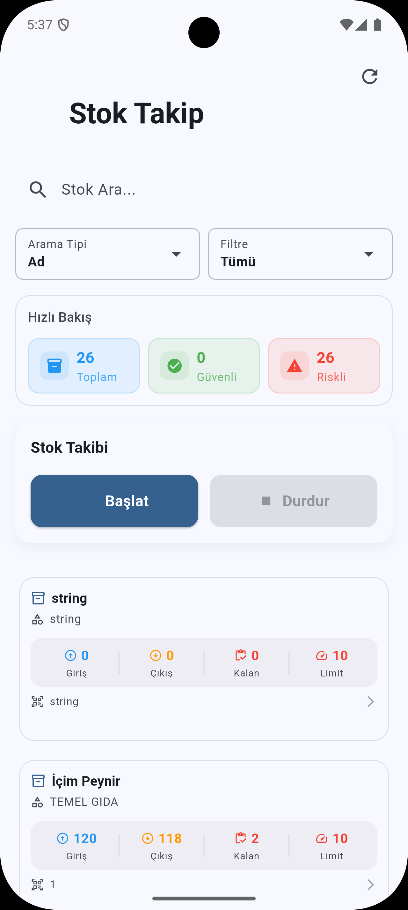
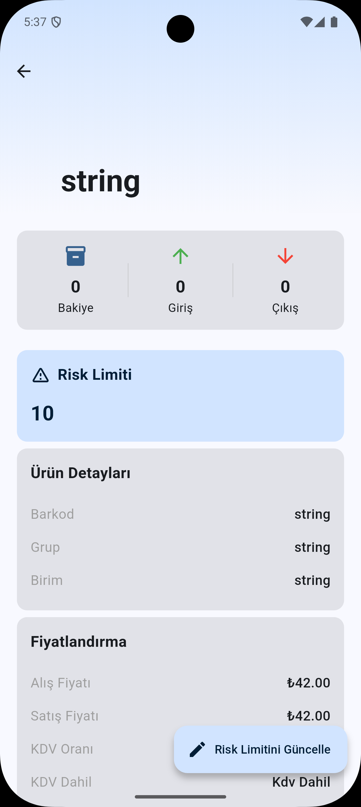
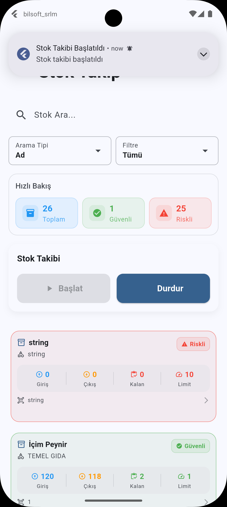

# Bilsoft Stok Risk Limit Modülü (SRLM)

## 📱 Uygulama Hakkında

Bilsoft Stok Risk Limit Modülü (SRLM), işletmenizin stok yönetimini akıllı bir şekilde takip etmenizi sağlayan modern bir Flutter uygulamasıdır. Bu uygulama ile stoklarınızı anlık olarak izleyebilir, risk limitlerini belirleyebilir ve stok hareketlerinizi detaylı bir şekilde analiz edebilirsiniz.

## 📸 Ekran Görüntüleri

### 🎥 Uygulama Önizlemesi

_Stok takip sisteminin canlı kullanımı_

### Ana Ekran

_Stok takibi ana ekranı - Hızlı bakış, arama ve filtreleme özellikleri_

_Stok izleme durumu ve risk takibi_

### Detay Ekranı

_Ürün detayları ve risk limiti yönetimi_

## 🚀 Temel Özellikler

### 📊 Akıllı Stok Takibi

- Giriş, çıkış ve kalan stok miktarlarını anlık görüntüleme
- Stok risk limitlerini özelleştirme
- Riskli ve güvenli stok durumlarını renk kodlarıyla izleme

### 🔍 Gelişmiş Arama ve Filtreleme

- Ürün adı veya grup bazında arama
- Özelleştirilebilir filtreler:
  - Tüm Stoklar
  - Stokta Olanlar
  - Stoğu Riskte Olanlar

### 📈 Detaylı Stok Analizi

- Her ürün için detaylı stok kartı
- Ürün bazında:
  - Barkod bilgisi
  - Grup ve birim bilgileri
  - Stok rafı takibi
  - Fiyatlandırma detayları
  - KDV bilgileri

### ⚡ Gerçek Zamanlı İzleme

- Stok takip sistemini başlatma/durdurma
- Risk durumunda anlık bildirimler
- Otomatik stok durumu güncellemeleri

## 💻 Kullanım Kılavuzu

### Ana Ekran Özellikleri

1. **Üst Panel**

   - Toplam stok sayısı
   - Güvenli stok sayısı
   - Riskli stok sayısı

2. **Arama ve Filtreleme**

   - Ürün adı veya grup ile arama
   - Stok durumuna göre filtreleme
   - Hızlı erişim filtreleri

3. **Stok İzleme**
   - Başlat/Durdur kontrolleri
   - Anlık stok durumu takibi

### Detay Ekranı Özellikleri

1. **Stok Bilgileri**

   - Giriş/Çıkış miktarları
   - Güncel bakiye
   - Risk limiti

2. **Ürün Detayları**

   - Barkod
   - Grup
   - Birim
   - Raf bilgisi

3. **Fiyatlandırma**
   - Alış fiyatı
   - Satış fiyatı
   - KDV oranı
   - KDV dahil/hariç durumu

## 🔄 Sürüm Geçmişi

### Versiyon 1.0.0

- İlk sürüm
- Temel stok yönetimi özellikleri
- Risk limit modülü
- Gerçek zamanlı izleme sistemi

## 📝 Lisans

© 2024 Bilsoft. Tüm hakları saklıdır.

---

[Ekran görüntüleri için yer tutucu]
[Video için yer tutucu]
